# Organic Growth Engine: Strategic SEO Guide

## Table of Contents

1. [Understanding Search Engines in 2026](#chapter-1)
2. [Keyword Research & Strategy](#chapter-2)
3. [On-Page SEO Excellence](#chapter-3)
4. [Technical SEO Fundamentals](#chapter-4)
5. [Local SEO Mastery](#chapter-5)
6. [Link Building & Authority](#chapter-6)
7. [AI & SEO: The New Frontier](#chapter-7)

---

<a id="chapter-1"></a>
## Chapter 1: Understanding Search Engines

### What is SEO?

Search Engine Optimization (SEO) is the practice of optimizing your website to appear higher in search engine results pages (SERPs). While the term "search engine optimization" was coined in 1997, the practice has evolved dramatically—especially with Google's 2026 algorithm updates emphasizing quality, user experience, and AI integration.

**Current State (2026):** Google has rolled out multiple major core updates during 2025, with the June 2025 update showing high volatility in health, finance, and e-commerce sectors, particularly affecting sites with thin or stale content.

### The Main Street Analogy

Think of yourself as a shop owner in a busy town. The main street sees tons of foot traffic—that's prime real estate. In the online world, Google's first page is that main street. Businesses appearing there attract the most clicks and potential customers.

**Why it matters:** The higher you rank, the more visibility you get. SEO is about making your website easy to find for potential customers searching for what you offer.

### How Search Engines Work

Modern search engines operate through three primary processes:

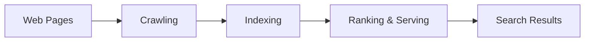

#### 1. Crawling

Crawlers (also called spiders or bots) automatically discover and visit web pages. They follow links from page to page, collecting information about new and updated content.

**Key Points:**

- Fully automated process
- Some pages may be blocked by robots.txt
- Search engines decide which pages to crawl and how often

#### 2. Indexing

After crawling, search engines analyze the page content—text, images, videos—to understand what it's about. This information is stored in a massive database (the index).

**What they analyze:**

- Keywords and content topics
- Images and alt text
- Video content
- Meta tags and structured data
- Technical page details
- Page relationships and links

**Critical:** If a page isn't indexed, it won't appear in search results.

#### 3. Serving

When someone searches, the engine retrieves the most relevant results from its index. Results are personalized based on:

- User location
- Search history
- Device type
- Language
- Time of day

### Types of Search Queries

Understanding user intent is crucial for effective SEO. Queries fall into three main categories:

| Query Type | User's Goal | Intent Words | Example | Optimization Focus |
|------------|-------------|--------------|---------|-------------------|
| **Informational** | Learn or find answers | How, what, why, guide, tips | "How to optimize images for SEO" | Blog posts, guides, tutorials |
| **Navigational** | Find a specific site/brand | Brand names, login, homepage | "Google Search Console" | Brand recognition, site speed |
| **Transactional** | Complete an action | Buy, order, download, book | "Buy SEO tools online" | Product pages, clear CTAs |

### Real-World Application: Thailand Travel Agency

Let's see how a travel agency would create content for different query types:

**Informational Content:**

- "Ultimate Guide to Thailand Travel: Culture, Destinations & Tips"
- "What to Pack for Your Thailand Adventure"
- Video: "Exploring Bangkok in 3 Days"

**Navigational Optimization:**

- Title: "MyThaiAdventures | Your Thai Adventure Starts Here"
- Meta Description: "MyThaiAdventures is a leading travel company specializing in Thai adventures. Book your journey today!"

**Transactional Pages:**

- "Book Thailand Adventure Tour - Save 20%"
- Clear CTAs: "Reserve Your Bangkok Tour Today"
- Product pages with detailed itineraries and booking options

### Current Ranking Factors (2026)

Google's recent algorithm updates emphasize authoritative content, with expert-led, well-sourced pages gaining the most visibility, while thin content has lost significant visibility especially in health, finance, and e-commerce sectors.

**Primary factors include:**

1. **Content Quality & E-E-A-T** (Experience, Expertise, Authoritativeness, Trust)
2. **User Experience** (Core Web Vitals, mobile-friendliness)
3. **Relevance** (matching search intent)
4. **Authority** (backlinks from trusted sources)
5. **Freshness** (updated, current information)
6. **Technical Health** (site speed, mobile optimization, proper indexing)

### Key Takeaway

Different pages serve different purposes. Create separate pages tailored to specific intents (informational, navigational, transactional), and align your SEO strategy accordingly. Each page should target appropriate keywords and meet specific user needs.

---

<a id="chapter-2"></a>
## Chapter 2: Keyword Research & Strategy

Keywords are the foundation of SEO. They're the actual words and phrases users type into search engines. Your goal is to identify these terms and create valuable content around them.

### What is Keyword Research?

Keyword research identifies the terms and phrases your target audience uses when searching. These search queries represent problems users want solved. By understanding their language, you can create content that directly addresses their needs.

> **2026 Reality:** While keywords remain important, semantic search and AI mean you must focus on topics and intent, not just exact keyword matches.

### Why Keyword Research Matters

- **Wrong keywords** = Wrong traffic (or no traffic)
- **Missed keywords** = Lost opportunities and helping competitors rank
- **Right keywords** = Qualified visitors who convert

> "Good keyword research creates a roadmap for your entire digital strategy"

### How to Do Keyword Research

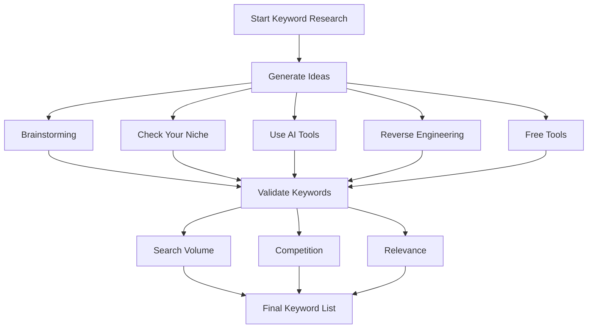

### Step 1: Generate Keyword Ideas

#### A. Brainstorming with Search Engines

1. **Google Autocomplete:** Start typing your topic in Google's search box. The suggestions show what people actually search for.
2. **"People Also Ask":** Scroll through search results to find common questions.
3. **Related Searches:** At the bottom of search results, Google shows related queries.

**Pro Tip:** Write down ALL relevant keywords you find—you'll refine the list later.

#### B. Check Your Niche Communities

Online communities reveal how people naturally discuss topics:

- **Reddit** - Subreddits related to your industry
- **Quora** - Questions people are asking
- **Facebook Groups** - Community discussions
- **Twitter/X** - Trending hashtags
- **Industry Forums** - Specialized discussions

**Example Searches:**

- "Thailand tours forum"
- "Thailand tours community"
- "Thailand tours discussion board"

#### C. Let AI Generate Keywords

AI tools can automate keyword research, with 75% of SEO experts using AI to reduce time spent on manual tasks like keyword research, and AI-powered keyword research tools using machine learning and natural language processing to analyze vast amounts of data.

**Effective AI Prompt Example:**

```
Hey ChatGPT, I'm optimizing my travel website's SEO. Generate a list of 
high-traffic keywords related to 'adventure travel destinations' targeting 
adventure-seeking travelers. Include:
- Primary keywords (high volume)
- Long-tail variations
- Question-based queries
- Related topics for content clusters
```

**Benefits:**

- Saves hours of manual work
- Discovers unique keyword opportunities
- Identifies semantic variations
- Suggests content cluster ideas

#### D. Reverse Engineer Competitors

Analyze what's working for competitors who rank better than you:

**Steps:**

1. **Identify Competitors:** Find 3-5 sites ranking for your target keywords
2. **Analyze Their Content:** Study their:
   - Homepage and main service pages
   - Blog posts and guides
   - Content structure and topics
3. **Check Meta Tags:**
```html
<title>Explore Thailand with Amazing Tours - Unforgettable Experiences</title>
<meta name="description" content="Discover Thailand's beauty with our curated tour packages. From beaches to temples, we offer experiences for every traveler.">
```
4. **Study Headings:**
```html
<h1>Uncover the Wonders of Thailand: Our Tour Packages</h1>
<h2>Island Escapes: Discover Thailand's Stunning Beaches</h2>
<h3>Cultural Immersion: Explore Ancient Temples</h3>
```
5. **Examine Alt Text:**
```html

```
6. **Analyze Anchor Text:**
- Internal: "Experience authentic Thai cuisine" (links to food tours page)
- External: "Top attractions in Bangkok" (links to city guide)

**Important:** Only reverse engineer competitors who rank BETTER than you for your target keywords.

#### E. Free Keyword Research Tools

**Google Keyword Planner** (Free)

- Access through Google Ads account
- Provides search volume estimates
- Shows keyword ideas and competition
- Essential for validating keyword potential

**Answer The Public** (answerthepublic.com)

- Generates questions people ask
- Shows autocomplete data from Google
- Visual representation of keyword relationships
- Great for content ideation

**Soovle** (soovle.com)

- Aggregates suggestions from multiple search engines
- Includes Google, Bing, Amazon, YouTube, Wikipedia
- Quick way to see keyword variations

**Google Trends** (trends.google.com)

- Compare keyword popularity over time
- Identify seasonal trends
- Location-based research
- Find rising search terms
- Forecast future demand

### Step 2: Validate Your Keywords

Not all keywords are worth targeting. Evaluate each based on:

1. **Search Volume:** How many people search for it monthly?
   - Use Google Keyword Planner for estimates
   - Focus on keywords with reasonable volume for your niche

2. **Competition:** How difficult is it to rank?
   - Check the quality of sites currently ranking
   - Assess if you can create better content

3. **Relevance:** Does it match your business?
   - Can you provide a valuable answer?
   - Will visitors convert?

4. **User Intent:** What are searchers looking for?
   - Informational? Create guides and tutorials
   - Transactional? Optimize product/service pages
   - Navigational? Ensure brand visibility

### Pillar & Content Clusters Strategy

The most effective way to organize your keyword research is through the Pillar & Content Clusters approach.

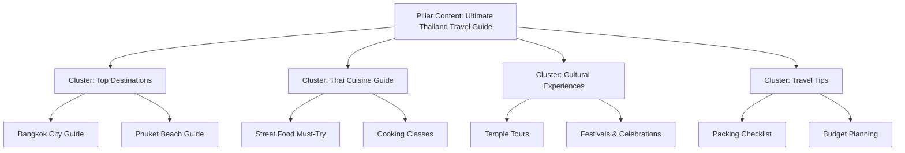

#### What Are Pillar & Content Clusters?

**Pillar Content:**

- Comprehensive, authoritative guide on a broad topic
- Covers the main subject in depth
- Serves as the cornerstone for related content
- Example: "The Ultimate Guide to Exploring Thailand"

**Content Clusters:**

- Related articles covering specific subtopics
- Link back to pillar content
- Provide detailed information on narrower subjects
- Example: "Best Time to Visit Thailand," "Thai Street Food Guide"

#### Why This Strategy Matters

**1. Enhanced SEO**

- Logical structure helps search engines understand your site
- Improves rankings for both broad and specific queries
- Increases chances of appearing in featured snippets

**2. Improved User Experience**

- Keeps visitors engaged longer
- Encourages exploration of related topics
- Reduces bounce rate

**3. Authority & Trust**

- Positions you as an expert in your field
- Builds credibility through comprehensive coverage
- Encourages return visits

**4. Guides Customer Journey**

- **Top of Funnel (Awareness):** Pillar content sparks interest
- **Middle of Funnel (Consideration):** Clusters provide detailed information
- **Bottom of Funnel (Decision):** Conversion-focused content drives action

### Implementing Pillar & Content Clusters

#### Step 1: Identify Your Pillar Topic

Choose a broad theme representing your expertise:

- Should be comprehensive and valuable
- Target audience actively searches for it
- Example: "Thailand Travel" for a travel agency

#### Step 2: Create Pillar Content

Develop an in-depth, ultimate guide:

- Covers all major aspects of the topic
- 3,000-5,000+ words (comprehensive)
- Includes clear navigation to cluster topics
- Example: "Ultimate Guide to Exploring Thailand: Destinations, Culture & Activities"

**Pillar Content Elements:**

- Overview of the main topic
- Sections on key subtopics
- Links to detailed cluster articles
- High-quality images and media
- Internal navigation (table of contents)

#### Step 3: Brainstorm Cluster Ideas

Identify subtopics for detailed articles:

- "Best Time to Visit Thailand"
- "Must-Try Thai Dishes"
- "Thailand Packing Tips"
- "Thai Temples: A Spiritual Journey"
- "Island Hopping Guide"

#### Step 4: Create High-Quality Cluster Content

Write in-depth articles for each subtopic:

- 1,500-2,500 words per cluster article
- Include expert insights and original information
- Link back to pillar content
- Link to related clusters

#### Step 5: Optimize for SEO

Implement on-page optimization:

- Target specific keywords in titles and headers
- Write compelling meta descriptions
- Optimize images with descriptive alt text
- Use internal linking strategically
- Add relevant external links to authoritative sources

#### Step 6: Interlink Your Content

Create a web of connections:

- Each cluster links to pillar content
- Clusters link to related clusters
- Pillar content links to all relevant clusters
- Use descriptive anchor text

**Example Internal Link:**
```html
Learn more about <a href="/thai-cuisine-guide">authentic Thai street food</a> 
and the best places to try it.
```

#### Step 7: Consistent Publishing

Maintain momentum:

- Regularly add new cluster articles
- Update existing content with fresh information
- Keep pillar content current
- Monitor performance and adjust strategy

### Real-World Example: User Journey

**Scenario:** You're planning a trip to Thailand.

1. **Discovery (Pillar Content):**

   - Search: "Thailand travel guide"
   - Find: "The Ultimate Guide to Exploring Thailand"
   - Read comprehensive overview with sections on destinations, culture, and travel tips

2. **Exploration (Content Clusters):**

   - Click on "Top Destinations in Thailand"
   - Discover detailed information about Bangkok, Chiang Mai, Phuket
   - Each destination links to its own detailed guide

3. **Deep Dive (Cluster Detail):**

   - Navigate to "Thai Cuisine: A Culinary Adventure"
   - Learn about:
     - "Pad Thai: The Iconic Street Food"
     - "Tom Yum Goong: Spicy Thai Soup"
     - "Cooking Classes in Thailand"

4. **Continued Journey:**

   - Return to pillar content
   - Explore "Hidden Gems: Off-the-Beaten-Path Destinations"
   - Discover remote islands and temples through interconnected content

**Result:** Comprehensive journey through well-organized, interconnected content builds trust and guides toward booking decision.

### Key Takeaway

Keyword research creates your digital strategy roadmap. The Pillar & Content Clusters strategy enhances SEO, improves user experience, and guides customers through the buying funnel—building trust and driving conversions. Well-placed internal links ensure seamless transitions, connecting pillar content to clusters and creating a web of information aligned with the customer journey.

---

<a id="chapter-3"></a>
## Chapter 3: On-Page SEO Excellence

On-page SEO optimizes individual web pages to rank higher and earn more relevant traffic. It involves enhancing content, HTML elements, and overall page structure for both users and search engines.

### Critical On-Page Elements

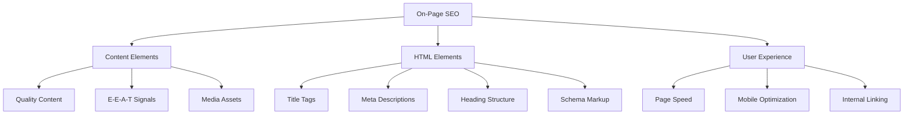

### 1. Page Titles

The title tag is what appears as the clickable headline in search results. It's one of the most important on-page SEO elements.

**Best Practices:**

- **Length:** 50-60 characters (avoid truncation)
- **Keyword Placement:** Put target keyword near the beginning
- **Clarity:** Make it descriptive and compelling
- **Uniqueness:** Every page needs a unique title

**Example:**
```html
<title>Thailand Tour Packages: Customized Itineraries for Perfect Vacations</title>
```

**Good:** "Best Running Shoes 2026: Expert Reviews & Buying Guide"
**Bad:** "Running Shoes | Products | Our Store | Buy Now"

### 2. Meta Descriptions

Brief summaries (150-160 characters) appearing below the title in search results. While not a direct ranking factor, they significantly impact click-through rates.

**Best Practices:**

- Include target keyword naturally
- Write compelling copy that encourages clicks
- Include a call-to-action when appropriate
- Stay within character limits

**Example:**
```html
<meta name="description" content="Discover Thailand's beauty with our expertly curated tour packages. From pristine beaches to ancient temples, create unforgettable memories. Book today!">
```

**Note:** Google may rewrite your meta description if it determines another snippet from your page better matches the search query.

### 3. Heading Structure

Headings (H1, H2, H3, H4, H5, H6) organize content and signal hierarchy to both users and search engines.

**Proper Hierarchy:**
```html
<h1>Main Page Title (Only One Per Page)</h1>

<h2>Major Section</h2>
  <h3>Subsection</h3>
  <h3>Another Subsection</h3>

<h2>Another Major Section</h2>
  <h3>Subsection</h3>
    <h4>Detailed Point</h4>
```

**Best Practices:**

- **One H1 per page** - Usually your main title
- **Logical structure** - Don't skip levels (H2 → H4)
- **Include keywords** - Naturally, not forced
- **Descriptive** - Headings should clearly indicate content
- **Accessibility** - Screen readers use headings for navigation

**Benefits:**

- Improves keyword relevance
- Enhances user experience (scannability)
- Helps accessibility
- Aids search engine crawlers

### 4. Content Quality

Content is the most crucial element. Search engines rank pages higher when content is useful, relevant, and satisfies user intent.

#### Content Purpose

Match content to user intent:

- **E-commerce sites:** Focus on transactional keywords (product descriptions, buying guides)
- **Blogs:** Target informational keywords (how-tos, guides, tutorials)
- **Service pages:** Address specific needs and solutions

#### AI-Generated Content in 2026

**Google's Official Stance:**

Google does not penalize content simply because it was created using AI. As of January 2026, 19% of Google search results include AI content, and 13% of top-rated content is AI-generated.

**What matters:**

- Quality and usefulness
- Trustworthiness
- Whether it helps users

**When AI Content Gets Penalized:**

- Created solely to manipulate rankings
- Provides no value to users
- Published at scale without quality control
- Contains inaccurate information ("hallucinations")
- Simply scraped or "spun" from competitors

#### Responsible AI Content Workflow

The human contribution must dominate:

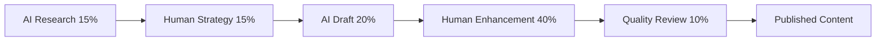

**1. AI Research & Outline (15%)**

- Use AI for initial structure
- Generate content outline
- Identify key topics

**2. Human Strategy (15%)**

- Refine outline based on expertise
- Add unique angle or perspective
- Align with brand voice

**3. AI Draft Generation (20%)**

- Create foundational text
- Generate initial content

**4. Human Enhancement (40%)** - **MOST CRITICAL**

- Add personal anecdotes and experiences
- Fact-check EVERY claim
- Insert brand voice and personality
- Add unique insights and data
- Improve readability and flow

**5. Quality Review (10%)**

- Ensure E-E-A-T signals present
- Verify natural tone (remove "AI-isms")
- Final fact-check and proofread

### 5. E-E-A-T: The Quality Framework

Google evaluates "high quality" content through E-E-A-T signals.

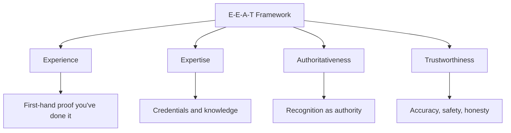

#### Experience

**Does the creator have first-hand experience?**

Google rewards proof that you've actually used the product, visited the location, or performed the service.

**AI vs. Human Example:**

❌ **AI (Generic):** "Thailand has beautiful beaches."

✅ **Human (Experienced):** "When I visited Railay Beach last April, the limestone cliffs were breathtaking. The humidity was so intense my glasses fogged up instantly, but the view made it absolutely worth it. I recommend arriving before 9 AM to avoid crowds."

**How to Demonstrate Experience:**

- Include personal anecdotes
- Add original photos from your visits
- Share specific details (dates, weather, prices)
- Describe what you saw, heard, smelled, felt

#### Expertise

**Does the author have necessary knowledge or skills?**

**How to Show Expertise:**

- **Author Bios:** Include credentials, degrees, certifications, years of experience
- **Bylines:** Always attribute content to named authors
- **Bio Pages:** Create detailed author pages with backgrounds
- **LinkedIn Profiles:** Link to professional profiles

**2026 Tip:** If using AI for content creation, have a subject matter expert review and refine the output to ensure industry-specific terminology is used correctly.

**Example Author Bio:**
```
Written by Sarah Thompson
Sarah is a certified travel specialist with 12 years of experience planning Southeast Asian 
adventures. She's visited Thailand 15+ times and holds certifications from the Tourism Authority 
of Thailand. She specializes in sustainable travel and cultural immersion experiences.
```

#### Authoritativeness

**Is the website a go-to source in the industry?**

Built when reputable websites link to your content and cite your brand.

**How to Build Authority:**

- Earn backlinks from high-quality, relevant sites
- Get mentioned in industry publications
- Contribute guest posts to authoritative sites
- Build relationships with influencers
- Create original research others cite

#### Trustworthiness (Most Critical)

**Is your site safe and honest?**

**Essential Trust Signals:**

1. **Fact-Check AI Content:** AI can "hallucinate" statistics and dates
   - Verify ALL dates, quotes, and citations
   - Use primary sources only

2. **HTTPS:** Non-negotiable security requirement
```html
https://yoursite.com (✓ Secure)
http://yoursite.com  (✗ Insecure)
```

3. **Contact Information:** Make it easy to reach you
   - Physical address (if applicable)
   - Phone number
   - Email address
   - Contact form

4. **About Page:** Clearly explain who you are and what you do

5. **Privacy Policy:** Required if collecting any user data

6. **Transparent Authorship:** Show real people behind the content

7. **Updated Content:** Display "Last Updated" dates

### 2026 Content Quality Checklist

Use this during your editorial process:

#### ✅ Experience & Expertise

- [ ] Clear author byline with credentials
- [ ] Bio page with qualifications and experience
- [ ] First-hand proof (personal stories, original photos/videos)
- [ ] If AI-assisted, reviewed by human subject matter expert

#### ✅ AI Content Control

- [ ] All dates, statistics, and citations fact-checked against primary sources
- [ ] Content provides unique angle or "un-Googleable" insight
- [ ] Edited to remove "AI-isms" (overly formal language, repetitive phrases)
- [ ] At least 40% of final text is unique human input

#### ✅ Trustworthiness & Authority

- [ ] External links to high-authority domains (.gov, .edu, industry leaders)
- [ ] Disclosure if AI played major role in creation
- [ ] "Last Updated" date showing current information
- [ ] Easy access to contact information

#### ✅ Technical E-E-A-T Signals

- [ ] Author and Person schema markup implemented
- [ ] Organization schema with social profiles and certifications
- [ ] Site running on HTTPS

### 6. Images and Videos

Visual content enhances engagement and provides optimization opportunities.

**Image Optimization:**

1. **Descriptive File Names:**
```
✓ thailand-beach-phuket.jpg
✗ IMG001.jpg
```

2. **Alt Text:** Critical for accessibility and SEO
```html

```

3. **Captions:** Provide additional context
```html
<figure>
  
  <figcaption>Wat Arun (Temple of Dawn) illuminated at sunset along the Chao Phraya River</figcaption>
</figure>
```

4. **File Size:** Compress without losing quality

   - Use WebP format when possible
   - Aim for under 100KB for most images
   - Use lazy loading for below-fold images

5. **Responsive Images:**
```html

```

**Video Optimization:**

- Add transcripts for accessibility
- Include descriptive titles and descriptions
- Create video sitemaps
- Use schema markup for video content
- Host on YouTube/Vimeo and embed

### 7. Internal Linking

Internal links connect pages within your site, helping search engines understand structure and spreading authority.

**Best Practices:**

1. **Link to Relevant Pages:**
```html
Learn more about <a href="/thailand-travel-tips">essential travel tips for Thailand</a>
before you book your adventure.
```

2. **Descriptive Anchor Text:**
```
✓ "discover our best Thai cooking classes"
✗ "click here"
✗ "read more"
```

3. **Natural Placement:** Within content, where it adds value

4. **Strategic Distribution:** Important pages should receive more internal links

5. **Breadcrumb Navigation:**
```html
Home > Destinations > Thailand > Bangkok
```

**Benefits:**

- Helps users navigate your site
- Distributes page authority (PageRank)
- Reduces bounce rate
- Improves time on site
- Helps search engines discover and understand content relationships

### 8. URL Structure

Clean, descriptive URLs improve both user experience and SEO.

**Best Practices:**

1. **Keep URLs Short and Descriptive:**
```
✓ example.com/thailand-tours
✗ example.com/page?id=12345&cat=tours&loc=th
```

2. **Use Hyphens (Not Underscores):**
```
✓ best-thai-beaches
✗ best_thai_beaches
```

3. **Include Target Keyword:**
```
✓ example.com/affordable-thailand-tours
```

4. **Avoid Keyword Stuffing:**
```
✗ example.com/best-cheap-thailand-tours-bangkok-phuket-book-now-discount
✓ example.com/thailand-tour-packages
```

5. **Use Lowercase:**
```
✓ example.com/bangkok-guide
✗ example.com/Bangkok-Guide
```

6. **Flat URL Structure (when possible):**
```
✓ example.com/thailand-beaches
✗ example.com/asia/southeast/thailand/attractions/beaches
```

### 9. Mobile Optimization

**Non-Negotiable in 2026:** Google uses mobile-first indexing for all websites.

**Critical Requirements:**

- Responsive design that adapts to all screen sizes
- Same content on mobile and desktop
- Fast loading times on mobile networks
- Touch-friendly buttons (minimum 48x48 pixels)
- Readable text without zooming (minimum 16px font)
- Adequate spacing between tap targets

**Test Your Mobile Site:**

- Google's Mobile-Friendly Test
- Chrome DevTools Device Mode
- Real device testing

### The Bottom Line for 2026

The question isn't "Will Google penalize AI content?" It's:

> **"Does this content genuinely help my audience and provide unique value?"**

Focus on creating content that:
- Demonstrates real experience and expertise
- Provides accurate, fact-checked information
- Offers unique insights unavailable elsewhere
- Serves user needs first, search engines second

---

<a id="chapter-4"></a>
## Chapter 4: Technical SEO Fundamentals

Technical SEO ensures search engines can crawl, understand, and index your website properly. It's the foundation that allows your content to be discovered and ranked.

**Critical Insight:** The best time for technical SEO is BEFORE building or relaunching your website, but you can improve existing sites too.

### Technical SEO Priorities

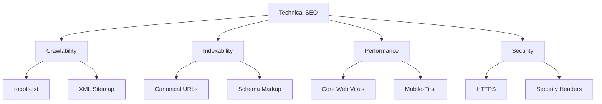

### 1. Specify a Preferred Domain

Your site can be reached via multiple URLs:

- http://site.com
- https://site.com
- http://www.site.com
- https://www.site.com

**Choose ONE** as your preferred domain and redirect all others to it.

**Recommended Setup:**
```
✓ https://www.yoursite.com (Preferred)
All other variations → Redirect here
```

**Why HTTPS?**

1. **Security:** Encrypts data transmission
2. **Ranking Signal:** Positive factor for Google and Bing
3. **Trust:** Users expect secure sites
4. **Required for modern features:** PWAs, service workers, modern APIs

**Implementation:**
Configure server settings and .htaccess (Apache) or nginx.conf (Nginx) to enforce redirects.

### 2. Optimize robots.txt

The robots.txt file tells search engines which pages they can and cannot crawl. It's located at your domain root: `https://yoursite.com/robots.txt`

**Example robots.txt:**
```
User-agent: *
Disallow: /admin/
Disallow: /private/
Disallow: /cart/
Disallow: /checkout/
Allow: /

Sitemap: https://yoursite.com/sitemap.xml
```

**Best Practices:**

- Don't block pages you want indexed
- Use for duplicate content prevention
- Block admin areas and private sections
- Always include sitemap location
- Test with Google Search Console's robots.txt Tester

**Common Mistakes:**
```
# DON'T DO THIS - blocks everything:
User-agent: *
Disallow: /

# DON'T block CSS/JS (Google needs these):
Disallow: /css/
Disallow: /js/
```

**Resources:**

- [Google's robots.txt Guidelines](https://developers.google.com/search/docs/crawling-indexing/robots/robots_txt)
- [Bing's robots.txt Guide](https://www.bing.com/webmasters/help/how-to-create-a-robots-txt-file-cb7c31ec)

### 3. URL Structure Optimization

Clean, descriptive URLs improve user experience and SEO.

**Good URL Structure:**
```
✓ https://example.com/running-shoes/mens-affordable-options
```

**Poor URL Structure:**
```
✗ https://example.com/best-cheap-running-shoes-for-men-buy-online-top-rated-sneakers-under-100-dollars
```

**Best Practices:**

- Use hyphens to separate words
- Keep URLs short and descriptive
- Include target keyword naturally
- Avoid excessive keyword stuffing
- Use lowercase letters
- Make URLs readable to humans

**Hierarchical Structure:**
```
example.com/category/subcategory/page
example.com/tours/thailand/bangkok-city-tour
```

### 4. Canonical URLs

Canonical tags tell search engines which version of a page is the "master" copy when duplicate or similar content exists.

**The Problem:**
```
https://example.com/thailand-tours
https://example.com/tours/thailand-tours
https://example.com/thailand-tours?utm_source=email
```

All three URLs show the same content but are treated as separate pages, diluting SEO value.

**The Solution:**
Add canonical tag to specify the preferred version:

```html
<head>
    <link rel="canonical" href="https://example.com/thailand-tours" />
</head>
```

**When to Use Canonical Tags:**

- Product pages accessible through multiple URLs
- Pages with URL parameters (tracking codes, filters)
- HTTP and HTTPS versions
- WWW and non-WWW versions
- Printer-friendly versions
- Session IDs in URLs

**Benefits:**

- Consolidates ranking signals
- Prevents duplicate content issues
- Clarifies preferred URL for search engines

### 5. XML Sitemaps

XML sitemaps act as a roadmap, listing all important pages on your site with metadata about each page.

**Basic Sitemap Structure:**
```xml
<?xml version="1.0" encoding="UTF-8"?>
<urlset xmlns="http://www.sitemaps.org/schemas/sitemap/0.9">
  <url>
    <loc>https://example.com/</loc>
    <lastmod>2026-01-15</lastmod>
    <changefreq>daily</changefreq>
    <priority>1.0</priority>
  </url>
  <url>
    <loc>https://example.com/thailand-tours</loc>
    <lastmod>2026-01-10</lastmod>
    <changefreq>weekly</changefreq>
    <priority>0.8</priority>
  </url>
</urlset>
```

**Sitemap Best Practices:**

- Include only indexable pages (no 404s, redirects, or blocked pages)
- Keep under 50MB and 50,000 URLs per sitemap
- Create multiple sitemaps for large sites
- Update regularly when content changes
- Include images, videos, and news sitemaps when relevant

**Submit Your Sitemap:**

- Google Search Console
- Bing Webmaster Tools
- Reference in robots.txt

**Resources:**

- [Google Sitemap Documentation](https://developers.google.com/search/docs/crawling-indexing/sitemaps/overview)
- [Bing Sitemap Guide](https://www.bing.com/webmasters/help/webmaster-guidelines-30fba23a)

### 6. Core Web Vitals (User Experience)

Core Web Vitals are Google's official metrics for measuring user experience. They've been ranking factors since 2021.

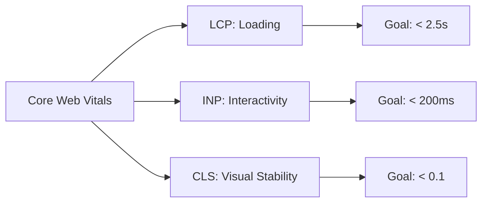

#### Largest Contentful Paint (LCP) - Loading

**What it measures:** Time for main content to appear

**User feeling:** "Is this happening?"

**Target:** Main content visible within **2.5 seconds**

**How to Improve:**

- Use a Content Delivery Network (CDN)
- Compress and optimize images (WebP format)
- Implement lazy loading for below-fold images
- Optimize server response time (TTFB under 600ms)
- Preload critical resources:
```html
<link rel="preload" href="hero-image.jpg" as="image">
```
- Minimize render-blocking CSS and JavaScript
- Use efficient caching strategies

**Common LCP Elements:**

- Hero images
- Header videos
- Large text blocks
- Background images

#### Interaction to Next Paint (INP) - Responsiveness

**Important Update (March 2024):** INP replaced First Input Delay (FID) as a Core Web Vital.

**What it measures:** How quickly your page responds to ALL user interactions throughout the page lifecycle

**User feeling:** "Why isn't this working?"

**Target:** Response within **200 milliseconds** or less

**How to Improve:**
- Break up long JavaScript tasks (use `async` or `defer`)
```html
<script src="script.js" defer></script>
```
- Minimize main thread blocking
- Use web workers for heavy computations
- Defer non-critical JavaScript
- Optimize event handlers
- Reduce third-party script impact
- Use `requestIdleCallback` API for non-urgent work

**Why INP is Challenging:**
Unlike FID (which only measured the first interaction), INP measures ALL interactions, making it more representative of real user experience but harder to optimize.

**Common INP Issues:**
- Heavy JavaScript frameworks
- Slow event handlers
- Third-party scripts blocking the main thread
- Unoptimized animations

#### Cumulative Layout Shift (CLS) - Visual Stability

**What it measures:** Unexpected layout shifts as page loads

**User feeling:** "That's so annoying!" (clicking wrong element)

**Target:** Score under **0.1**

**How to Improve:**
- Always set width and height dimensions for images and videos:
```html

```
- Reserve space for ads and embeds:
```css
.ad-container {
  min-height: 250px;
}
```
- Avoid inserting content above existing content
- Use `transform` animations (don't animate `top`, `left`, `width`, `height`)
```css
/* Good - doesn't cause layout shift */
.element { transform: translateY(10px); }

/* Bad - causes layout shift */
.element { margin-top: 10px; }
```
- Ensure web fonts don't cause FOIT/FOUT:
```css
@font-face {
  font-family: 'CustomFont';
  font-display: swap;
  src: url('font.woff2') format('woff2');
}
```

**Common CLS Culprits:**

- Images without dimensions
- Ads that push content down
- Dynamically injected content
- Web fonts loading late
- Iframes without dimensions

#### Testing Your Core Web Vitals

**Free Tools:**

1. **[PageSpeed Insights](https://pagespeed.web.dev/)** - Enter any URL for lab and field data
2. **[Google Search Console](https://search.google.com/search-console/)** - "Core Web Vitals" report shows which pages pass/fail
3. **[Chrome User Experience Report (CrUX)](https://developer.chrome.com/docs/crux/)** - Real-world user data
4. **Chrome DevTools** - Built-in testing during development

**Performance Budget Example:**

- LCP: < 2.5 seconds
- INP: < 200 milliseconds
- CLS: < 0.1
- Time to First Byte: < 600ms
- Total page size: < 3MB

### 7. Mobile-First Indexing

**Critical for 2026:** Google predominantly uses the mobile version of your site for indexing and ranking.

**What This Means:**

- Google crawls with a mobile user-agent
- Mobile version determines your rankings
- Desktop-only content is invisible to Google

**Action Items:**

- ✅ Ensure content parity (same content on mobile and desktop)
- ✅ Test mobile usability in Search Console
- ✅ Verify structured data appears on mobile
- ✅ Check mobile page speed separately
- ✅ Make all images and videos accessible on mobile
- ✅ Use readable font sizes (minimum 16px)
- ✅ Ensure tap targets are adequately sized (minimum 48x48 pixels)
- ✅ Avoid intrusive interstitials (pop-ups that block content)

**Mobile Testing Tools:**

- Google Mobile-Friendly Test
- Chrome DevTools Device Mode
- Real device testing (iOS and Android)
- BrowserStack or similar services

**Responsive Design Basics:**
```html
<meta name="viewport" content="width=device-width, initial-scale=1">
```

```css
/* Mobile-first approach */
.container {
  width: 100%;
  padding: 20px;
}

/* Desktop enhancement */
@media (min-width: 768px) {
  .container {
    max-width: 1200px;
    margin: 0 auto;
  }
}
```

### 8. JavaScript SEO

Modern websites increasingly rely on JavaScript frameworks (React, Vue, Angular, Next.js), which can create SEO challenges.

#### Client-Side Rendering Issues:

- Content may not be visible to crawlers
- Initial HTML is often empty
- Hydration delays affect Core Web Vitals

#### Solutions:

**1. Server-Side Rendering (SSR)**
Render on server, send complete HTML to users and crawlers

**Frameworks:**

- Next.js (React)
- Nuxt.js (Vue)
- Angular Universal

**2. Static Site Generation (SSG)**
Pre-build HTML at deploy time

**Tools:**

- Next.js (Static Export)
- Gatsby
- Eleventy

**3. Dynamic Rendering (Last Resort)**
Serve static HTML to bots, JavaScript to users

**Warning:** Only use when SSR/SSG isn't possible

#### Testing JavaScript Content:

**Google Search Console:**

1. Use "URL Inspection" tool
2. Check "View Rendered HTML"
3. Compare crawled and live versions

**Manual Testing:**

1. Disable JavaScript in browser
2. View page source
3. Use "Fetch as Google" tools

**Monitor:**

- Rendering errors in Search Console
- JavaScript console errors
- Loading performance

### 9. Structured Data (Schema Markup)

Schema markup helps search engines understand your content and can enable rich results.

**Benefits:**

- Enhanced search listings (rich snippets)
- Better understanding of content
- Potential for featured snippets
- Voice search optimization

**Common Schema Types:**

**Article Schema:**
```html
<script type="application/ld+json">
{
  "@context": "https://schema.org",
  "@type": "Article",
  "headline": "Ultimate Guide to Thailand Travel",
  "author": {
    "@type": "Person",
    "name": "Sarah Thompson",
    "url": "https://example.com/about/sarah"
  },
  "datePublished": "2026-01-15",
  "dateModified": "2026-01-15",
  "image": "https://example.com/images/thailand-guide.jpg",
  "publisher": {
    "@type": "Organization",
    "name": "Amazing Thailand Tours",
    "logo": {
      "@type": "ImageObject",
      "url": "https://example.com/logo.jpg"
    }
  }
}
</script>
```

**Product Schema:**
```html
<script type="application/ld+json">
{
  "@context": "https://schema.org",
  "@type": "Product",
  "name": "7-Day Bangkok & Beaches Tour",
  "image": "https://example.com/tour-image.jpg",
  "description": "Comprehensive Thailand tour combining city and beach experiences",
  "offers": {
    "@type": "Offer",
    "price": "1299.00",
    "priceCurrency": "USD",
    "availability": "https://schema.org/InStock"
  },
  "aggregateRating": {
    "@type": "AggregateRating",
    "ratingValue": "4.8",
    "reviewCount": "127"
  }
}
</script>
```

**FAQ Schema:**
```html
<script type="application/ld+json">
{
  "@context": "https://schema.org",
  "@type": "FAQPage",
  "mainEntity": [{
    "@type": "Question",
    "name": "What's the best time to visit Thailand?",
    "acceptedAnswer": {
      "@type": "Answer",
      "text": "The best time to visit Thailand is during the cool, dry season from November to February, when temperatures are pleasant and rainfall is minimal."
    }
  }]
}
</script>
```

**Testing Schema:**

- [Google's Rich Results Test](https://search.google.com/test/rich-results)
- [Schema Markup Validator](https://validator.schema.org/)
- Monitor Search Console's "Rich Results" report

### 10. International SEO

If your site serves multiple languages or regions, implement hreflang tags.

**Hreflang Implementation:**
```html
<link rel="alternate" hreflang="en-us" href="https://example.com/en-us/" />
<link rel="alternate" hreflang="en-gb" href="https://example.com/en-gb/" />
<link rel="alternate" hreflang="th" href="https://example.com/th/" />
<link rel="alternate" hreflang="x-default" href="https://example.com/" />
```

**URL Structure Options:**

1. **ccTLD (Country Code Top-Level Domain)**

   - example.co.th
   - Strongest geo-targeting signal
   - Most expensive and complex

2. **Subdomain**

   - th.example.com
   - Moderate signal, easier than ccTLD
   - Treated as separate site by Google

3. **Subdirectory**

   - example.com/th/
   - Easiest to manage, good signal
   - Consolidates domain authority

**Best Practices:**

- ✅ Return hreflang links bidirectionally
- ✅ Include self-referential hreflang
- ✅ Always specify `x-default` for unmatched regions
- ✅ Keep content genuinely localized (not just machine-translated)
- ✅ Validate with [Hreflang Tags Testing Tool](https://www.aleydasolis.com/english/international-seo-tools/hreflang-tags-generator/)

### 11. Crawl Budget Optimization

For large websites (10,000+ pages), managing how Google crawls your site becomes important.

**Factors Affecting Crawl Budget:**

- Site speed and server response time
- Duplicate content and low-quality pages
- Broken links and redirect chains
- URL parameters creating infinite spaces
- Sitemap quality and size

**Optimization Tactics:**

- ✅ Use robots.txt strategically
- ✅ Fix or remove broken pages promptly
- ✅ Use `noindex` for thin or duplicate pages
- ✅ Consolidate similar content
- ✅ Monitor crawl stats in Search Console
- ✅ Use URL parameters tool
- ✅ Keep sitemaps under 50MB and 50,000 URLs

**Crawl Budget Formula:**
```
Crawl Budget = Crawl Rate Limit × Crawl Demand
```

- **Crawl Rate Limit:** How fast Google can crawl without overloading your server
- **Crawl Demand:** How much Google wants to crawl your site (based on popularity and freshness)

### 12. Search Console & Webmaster Tools

Essential free tools every site owner must use.

#### Google Search Console

**Key Features:**

- **Performance Reports:** Clicks, impressions, CTR, average position
- **Coverage Reports:** Indexing status and errors
- **Core Web Vitals:** Performance monitoring
- **Mobile Usability:** Mobile-friendliness issues
- **Rich Results:** Structured data validation
- **Security Issues:** Malware and manual action alerts
- **Sitemap Submission:** Submit and monitor sitemaps

**Setup:**

1. Go to [search.google.com/search-console](https://search.google.com/search-console/)
2. Add your property (domain or URL prefix)
3. Verify ownership (DNS, HTML file, or tag)
4. Submit sitemap
5. Monitor regularly

**Critical Reports to Check Weekly:**

- Coverage (index status)
- Performance (traffic trends)
- Core Web Vitals (user experience)
- Mobile Usability (mobile issues)

#### Bing Webmaster Tools

**Key Features:**

- Site scan and SEO analyzer
- Backlink analysis
- Keyword research tools
- URL inspection
- Crawl control

**Setup:**

1. Go to [bing.com/webmasters](https://www.bing.com/webmasters/)
2. Add your site
3. Verify ownership
4. Import from Google Search Console (optional)

**Why Use Bing:**

- Second-largest search engine
- Powers Yahoo, DuckDuckGo, and other engines
- Different ranking algorithm provides insights
- Less competitive than Google

### Technical SEO Checklist

**Foundation:**

- [ ] Preferred domain specified (HTTPS)
- [ ] robots.txt optimized and tested
- [ ] XML sitemap created and submitted
- [ ] Canonical tags implemented
- [ ] 404 pages handled properly
- [ ] Redirects (301) for moved pages

**Performance:**

- [ ] Core Web Vitals passing (LCP < 2.5s, INP < 200ms, CLS < 0.1)
- [ ] Page speed optimized
- [ ] Images compressed and lazy-loaded
- [ ] CDN implemented
- [ ] Caching configured

**Mobile:**

- [ ] Mobile-first indexing ready
- [ ] Responsive design implemented
- [ ] Mobile usability issues resolved
- [ ] Touch targets appropriately sized

**Structured Data:**

- [ ] Schema markup implemented
- [ ] Rich results validated
- [ ] Author and Organization schema added

**Monitoring:**

- [ ] Google Search Console set up and verified
- [ ] Bing Webmaster Tools configured
- [ ] Regular crawl error monitoring
- [ ] Performance tracking in place

---

<a id="chapter-5"></a>
## Chapter 5: Local SEO Mastery

Local SEO helps businesses with physical locations appear in search results when people look for nearby products or services.

**Who Needs Local SEO:**

- Retail stores
- Restaurants and cafes
- Service providers (plumbers, electricians, landscapers)
- Medical practices
- Law firms
- Real estate agencies
- Any business serving a specific geographic area

### Local SEO Ecosystem

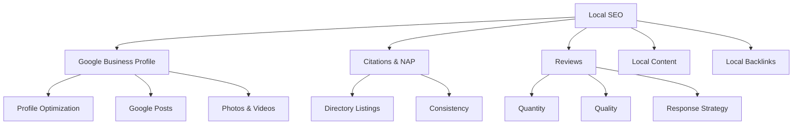

### 1. Google Business Profile (GBP)

**Formerly Google My Business** - Your most important local SEO asset.

#### Complete Every Field

**Essential Elements:**

- **Business Name:** Use legal name (no keyword stuffing)
- **Primary Category:** Most specific category for your main business
- **Secondary Categories:** Up to 9 additional categories
- **Business Description:** Use all 750 characters
- **Service Areas:** Define geographic coverage
- **Products/Services:** List everything you offer
- **Attributes:** Select all relevant (women-led, wheelchair accessible, etc.)
- **Hours:** Include special hours for holidays
- **Contact Info:** Phone, website, messaging

**Example Description:**
```
Amazing Thailand Tours specializes in authentic, sustainable travel experiences throughout 
Thailand. Since 2010, we've helped over 10,000 travelers explore Bangkok's temples, Phuket's 
beaches, and Chiang Mai's mountains. Our expert local guides create customized itineraries 
featuring cultural immersion, adventure activities, and culinary experiences. We're committed 
to responsible tourism, partnering with local communities and eco-friendly accommodations. 
Whether you're seeking luxury relaxation or budget backpacking, we'll craft your perfect Thai 
adventure. Book with confidence—we're certified by the Tourism Authority of Thailand.
```

#### Photo Strategy

**Photo Requirements:**

- Upload minimum 5+ photos per month
- Use high-quality images (720px minimum)
- Include various types:
  - **Exterior:** Your storefront/building
  - **Interior:** Your space and atmosphere
  - **Team:** Staff photos (builds trust)
  - **Products/Services:** In action
  - **Customers:** With permission
- Geo-tag images when possible
- Avoid stock photos—use authentic images

**Photo Performance:**

Businesses with photos receive 42% more requests for directions and 35% more click-throughs to websites compared to businesses without photos.

#### Google Posts

Keep your profile active with regular posts.

**Post Types:**

1. **Updates:** General news and announcements
2. **Offers:** Special deals and promotions
3. **Events:** Upcoming events with dates
4. **Products:** Highlighting specific products

**Best Practices:**

- Post at least weekly
- Posts expire after 7 days
- Include high-quality images
- Use clear calls-to-action
- Optimize with relevant keywords naturally

**Example Post:**
```
🌴 Spring Special: 20% Off Bangkok & Beaches Tour!

Explore Thailand's vibrant capital and pristine beaches this spring. Our 7-day package 
includes temple tours, street food experiences, and 3 days in Phuket. Limited availability!

Book by March 31st. Use code: SPRING20

[Learn More Button]
```

### 2. Reviews: The Local SEO Currency

Customer reviews are incredibly important for local rankings. More positive reviews = better rankings.

#### Review Strategy

**Encourage Reviews:**

- Send follow-up emails with direct links
- Make it easy (provide step-by-step instructions)
- Ask at the right time (after positive experience)
- Train staff to request reviews
- Add review links to email signatures

**Never:**

- ❌ Offer incentives for positive reviews (violates Google policies)
- ❌ Write fake reviews
- ❌ Ask customers to change/remove negative reviews
- ❌ Have employees review your business

#### Response Strategy

**Respond to ALL Reviews Within 24-48 Hours**

**Positive Reviews:**
```
Hi Jennifer,

Thank you so much for the wonderful 5-star review! We're thrilled you loved the temple 
tour and our guide Somchai. Your comment about the authentic street food experience made 
our day! We hope to welcome you back to Thailand soon.

Warm regards,
Sarah - Amazing Thailand Tours Team
```

**Negative Reviews:**
```
Hi Michael,

Thank you for sharing your feedback. We sincerely apologize that the hotel didn't meet 
your expectations. This is not the experience we want our guests to have. I'd love to 
discuss this further and make things right. Please contact me directly at 
sarah@amazingthailandtours.com.

Best regards,
Sarah Thompson, Customer Experience Manager
```

**Why Responses Matter:**

- Shows you care about customer satisfaction
- Addresses concerns publicly
- Demonstrates commitment to service quality
- Influences potential customers reading reviews

### 3. NAP Consistency (Critical)

**NAP = Name, Address, Phone Number**

Search engines cross-reference your business information across the web. Inconsistencies create doubt about legitimacy and hurt rankings.

**Common NAP Mistakes:**
```
✗ "123 Main St" vs "123 Main Street"
✗ Including suite numbers inconsistently
✗ Different phone numbers across platforms
✗ Abbreviating business name differently
```

**Correct NAP Format:**
```
✓ Amazing Thailand Tours
✓ 123 Main Street, Suite 200
✓ Seattle, WA 98101
✓ (206) 555-0123
```

**Where NAP Must Be Consistent:**

- Google Business Profile
- Bing Places
- Apple Maps (Apple Business Connect)
- Facebook Business Page
- Yelp, Yellow Pages
- Better Business Bureau
- Industry-specific directories
- Chamber of Commerce
- Your website (footer, contact page)
- Email signatures

#### NAP Audit Process

1. **Create Spreadsheet:** List all citation sources
2. **Document Current NAP:** Record exact formatting on each platform
3. **Identify Discrepancies:** Highlight differences
4. **Request Corrections:** Contact site administrators or use your login
5. **Track Completion:** Note dates fixed
6. **Monitor Quarterly:** Catch new inconsistencies

### 4. Local Citations & Directory Listings

Citations are online mentions of your business name, address, and phone number—even without a link.

**Top Citation Sources:**

- Google Business Profile
- Bing Places
- Apple Business Connect
- Yelp
- Yellow Pages
- Better Business Bureau
- Industry-specific directories
- Local Chamber of Commerce
- TripAdvisor (for tourism businesses)
- Angie's List / HomeAdvisor (for service providers)

**Benefits:**

- Acts like backlinks for local SEO
- Improves local pack rankings
- Increases brand visibility
- Provides referral traffic

**Citation Best Practices:**

- Ensure NAP consistency across all listings
- Complete profiles 100%
- Add photos and business description
- Keep hours updated
- Monitor and claim existing listings

### 5. Schema Markup for Local Business

Implement LocalBusiness schema to help search engines understand your business.

**Complete LocalBusiness Schema:**
```html
<script type="application/ld+json">
{
  "@context": "https://schema.org",
  "@type": "LocalBusiness",
  "name": "Amazing Thailand Tours",
  "image": "https://amazingthailandtours.com/logo.jpg",
  "@id": "https://amazingthailandtours.com",
  "url": "https://amazingthailandtours.com",
  "telephone": "+1-206-555-0123",
  "priceRange": "$",
  "address": {
    "@type": "PostalAddress",
    "streetAddress": "123 Main Street, Suite 200",
    "addressLocality": "Seattle",
    "addressRegion": "WA",
    "postalCode": "98101",
    "addressCountry": "US"
  },
  "geo": {
    "@type": "GeoCoordinates",
    "latitude": 47.6062,
    "longitude": -122.3321
  },
  "openingHoursSpecification": {
    "@type": "OpeningHoursSpecification",
    "dayOfWeek": [
      "Monday",
      "Tuesday",
      "Wednesday",
      "Thursday",
      "Friday"
    ],
    "opens": "09:00",
    "closes": "17:00"
  },
  "sameAs": [
    "https://www.facebook.com/amazingthailandtours",
    "https://www.instagram.com/amazingthailandtours",
    "https://www.linkedin.com/company/amazingthailandtours"
  ],
  "aggregateRating": {
    "@type": "AggregateRating",
    "ratingValue": "4.8",
    "reviewCount": "127"
  }
}
</script>
```

**More Specific Schema Types:**

- **Restaurant:** Use "Restaurant" type
- **Hotel:** Use "Hotel" or "LodgingBusiness"
- **Medical:** Use "MedicalBusiness" or more specific subtypes
- **Legal:** Use "LegalService" or "Attorney"

**Testing:**

- [Google's Rich Results Test](https://search.google.com/test/rich-results)
- [Schema Markup Validator](https://validator.schema.org/)

### 6. Local Backlinks

High-quality backlinks from local websites boost local rankings significantly.

**Target Sources:**

- Local news sites and blogs
- Chamber of Commerce
- Business associations (BBB, trade groups)
- Local universities (.edu links are valuable)
- Sponsored local events (with website listing)
- Community resource pages
- Complementary local businesses
- Local charities and non-profits

**Link Building Tactics:**

**1. Create Newsworthy Content:**
```
"Local Travel Agency Launches Scholarship for Students"
"Amazing Thailand Tours Partners with Seattle Schools for Cultural Exchange"
```

**2. Expert Quotes:**

Offer expertise to local journalists:
- HARO (Help a Reporter Out)
- Local news outlets
- Community blogs

**3. Event Sponsorship:**

- Local festivals
- Charity runs
- School events
- Community fundraisers

**4. Complementary Business Partnerships:**

Example for travel agency:

- Hotels
- Restaurants
- Tour operators
- Travel insurance companies
- Language schools

**5. Local Scholarships or Awards:**

Create annual awards:

- "Best Travel Essay Competition"
- "Emerging Travel Photographer Award"

### 7. Local Content Strategy

Create content that targets local keywords and serves local audiences.

**Content Ideas:**

**Location Pages:**
```
Seattle Travel Agency | Thailand Tours from SEA
- Why Choose a Seattle-Based Agency
- Direct Flights from Sea-Tac to Bangkok
- Seattle Residents' Guide to Thailand
- Testimonials from Seattle Travelers
```

**Local Event Coverage:**
```
"Thailand Festival in Seattle: What to Expect"
"Seattle's Best Thai Restaurants: Staff Picks"
"Preparing Seattle Residents for Thailand Weather"
```

**Local Guides:**
```
"Seattle to Bangkok: The Complete Travel Guide"
"Thailand Visa Requirements for Washington Residents"
"Currency Exchange in Seattle for Thailand Travel"
```

**Local Keywords:**

- "Thailand tours Seattle"
- "Seattle travel agency Thailand"
- "Thailand vacation planning near me"
- "Thai tour operator Seattle WA"

### Local Pack Ranking Factors (2026)

Understanding what influences Local Pack rankings (the map with 3 businesses):

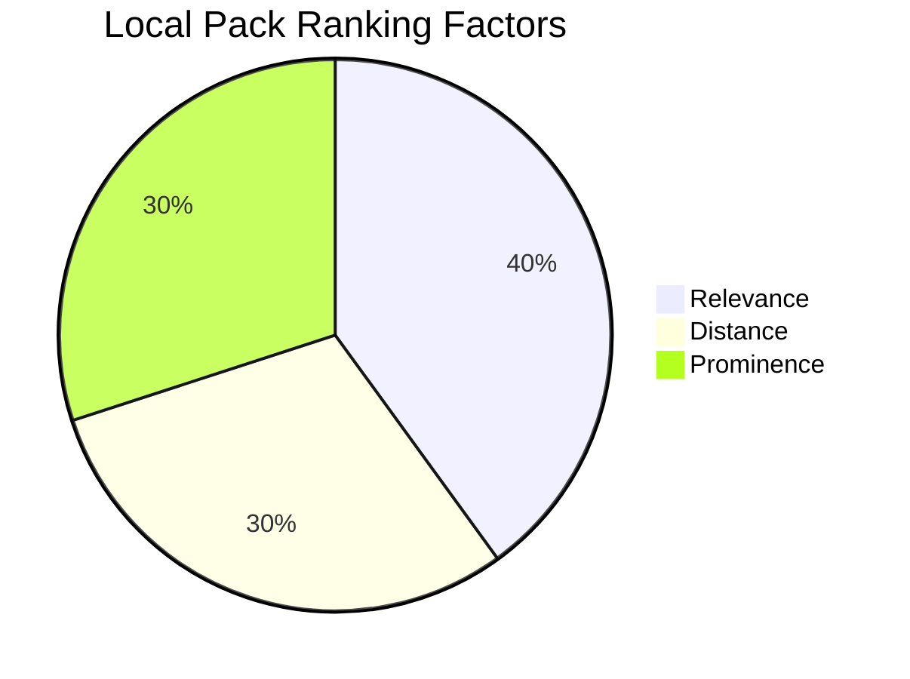

#### 1. Relevance (40%)

How well your business matches the search:

- Accurate category selection
- Business description keywords
- Google Posts content
- Website content alignment
- Services listed

#### 2. Distance (30%)

Physical proximity to searcher:

- Based on searcher's actual location
- Cannot be manipulated
- Service area businesses define coverage zones

#### 3. Prominence (30%)

How well-known and trusted:

- Review quantity and quality
- Review recency and velocity
- Citation consistency
- Backlink profile quality
- Offline brand recognition
- Website authority

### Free Local SEO Tools

#### Google Business Profile
[google.com/business](https://www.google.com/business/)

**Setup Steps:**

1. Sign in with Google account
2. Enter business name and address
3. Choose business category
4. Add contact information
5. Verify business (postcard, phone, or email)
6. Complete profile fully
7. Add photos and description
8. Start collecting reviews

#### Bing Places for Business
[bingplaces.com](https://www.bingplaces.com/)

**Setup Steps:**

1. Create account
2. Input business information
3. Verify listing
4. Add photos
5. Manage reviews

**Why Bing Matters:**

- Powers Cortana, Alexa, and Siri local results
- Less competition than Google
- Different user demographic
- Additional visibility

#### Apple Business Connect
[businessconnect.apple.com](https://businessconnect.apple.com/)

**Why Apple Maps:**

- Pre-installed on all iPhones
- Growing market share
- Used by Siri for local queries
- Integration with Apple ecosystem

**Setup Steps:**

1. Sign in with Apple ID
2. Claim or add business
3. Verify business
4. Complete information
5. Monitor and update

### Local SEO Checklist

**Foundation:**

- [ ] Google Business Profile claimed and verified
- [ ] Bing Places claimed and verified
- [ ] Apple Business Connect set up
- [ ] NAP consistency verified across top 20 citations
- [ ] LocalBusiness schema implemented

**Google Business Profile Optimization:**

- [ ] All fields 100% completed
- [ ] 10+ high-quality photos uploaded
- [ ] Weekly Google Posts scheduled
- [ ] All reviews responded to within 48 hours
- [ ] Products/services fully listed
- [ ] Attributes accurately selected
- [ ] Hours updated (including special hours)

**Website Optimization:**

- [ ] Contact page with NAP and embedded map
- [ ] Location pages for each service area
- [ ] LocalBusiness schema on every page
- [ ] Mobile-friendly and fast loading
- [ ] Service areas clearly described
- [ ] Local keywords in content

**Citations & Reviews:**

- [ ] Listed in top 10 industry directories
- [ ] NAP consistent across minimum 20 citations
- [ ] Actively collecting 5+ reviews per month
- [ ] Review response system in place
- [ ] Review generation emails automated

**Backlinks & Content:**

- [ ] Listed with local Chamber of Commerce
- [ ] 5+ local link opportunities identified
- [ ] Local content calendar created
- [ ] Location-specific pages published
- [ ] Local event coverage planned

**Monitoring:**

- [ ] Google Business Profile insights reviewed weekly
- [ ] Review alerts set up
- [ ] Citation monitoring scheduled quarterly
- [ ] Local rankings tracked monthly
- [ ] Competitor analysis ongoing

---

<a id="chapter-6"></a>
## Chapter 6: Link Building & Authority

Link building is the process of acquiring backlinks (links from other websites to yours). Backlinks are like votes of confidence—they signal to search engines that your content is valuable and trustworthy.

### Why Link Building Matters

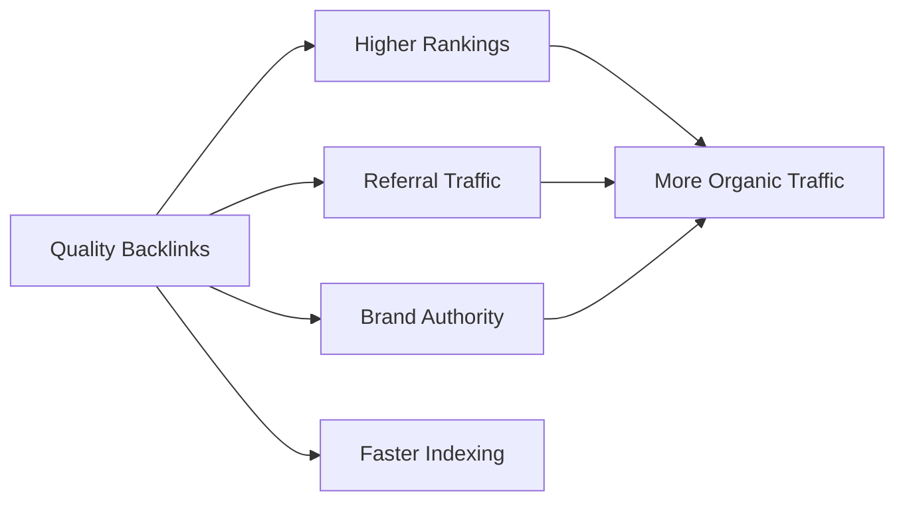

**Key Principles:**

1. **Quality Over Quantity:** One link from a reputable site beats 100 from low-quality sites
2. **Relevance Matters:** Links from sites in your industry carry more weight
3. **Natural Profile:** A mix of link types looks more organic
4. **Ongoing Process:** Link building never stops

### Types of Backlinks

**1. Editorial Links (Best)**

- Earned naturally when others reference your content
- Result of creating valuable, link-worthy content
- Examples: Cited in articles, research, resource lists

**2. Manual Outreach Links**

- Acquired through deliberate outreach
- Examples: Guest posts, partnerships, collaborations

**3. Self-Created Links (Use Sparingly)**

- Created by you on other platforms
- Examples: Forum signatures, blog comments
- Low value, can be spammy if overused

### Link Quality Factors

**High-Quality Link Characteristics:**

- ✅ From authoritative, trusted domains
- ✅ Relevant to your industry/niche
- ✅ Contextual (within content, not sidebar/footer)
- ✅ Uses natural anchor text
- ✅ From diverse domains
- ✅ From pages with traffic
- ✅ Dofollow (passes link equity)

**Low-Quality Link Characteristics:**

- ❌ From spammy or irrelevant sites
- ❌ From link farms or PBNs
- ❌ Site-wide links (footer/sidebar on every page)
- ❌ Over-optimized anchor text
- ❌ From penalized websites
- ❌ Paid links without proper disclosure

### Link Building Strategies

#### 1. Create Link-Worthy Content

**The Foundation:** Great content attracts natural links.

**Link Magnet Content Types:**

**Original Research & Data:**
```
"2026 Thailand Tourism Statistics: Comprehensive Analysis"
"Survey: What Travelers Really Want from Tour Operators"
```

**Comprehensive Guides:**
```
"The Ultimate 10,000-Word Guide to Thailand Travel"
"Complete SEO Guide for Travel Agencies"
```

**Infographics:**
```
"Thailand's Islands: A Visual Guide"
"The History of Thai Cuisine [Infographic]"
```

**Tools & Resources:**
```
"Free Thailand Itinerary Planner Tool"
"Thailand Travel Budget Calculator"
```

**Case Studies:**
```
"How We Helped 50 Families Plan Perfect Thailand Vacations"
"From 0 to 10,000 Monthly Visitors: Our SEO Journey"
```

#### 2. Resource Page Link Building

Many websites maintain pages that list helpful resources in their industry.

**Finding Resource Pages:**
```
Google Searches:
- "Thailand travel" + "resources"
- "Thailand" + "helpful links"
- "Thailand tourism" + "useful sites"
- inurl:links "Thailand travel"
- inurl:resources "Southeast Asia travel"
```

**Outreach Template:**
```
Subject: Resource suggestion for your Thailand travel page

Hi [Name],

I came across your excellent resource page about Thailand travel 
(https://theirsite.com/thailand-resources) and found it incredibly helpful.

I noticed you link to several travel planning guides. I recently published a 
comprehensive guide that your readers might find valuable:

[Your URL]: "Ultimate Guide to Thailand Travel Planning"

It covers:
- Detailed destination breakdowns
- Budget planning worksheets
- Cultural etiquette tips
- Safety guidelines

Would you consider adding it to your resource page? I'd be happy to reciprocate 
if you have content that would benefit my audience.

Thanks for curating such a helpful resource!

Best regards,
[Your Name]
```

#### 3. Competitor Backlink Analysis

Discover where competitors get links and pursue similar opportunities.

**Tools for Analysis:**

- Ahrefs (Paid)
- SEMrush (Paid)
- Moz Link Explorer (Freemium)
- Ubersuggest (Freemium)

**Process:**

1. **Identify Competitors:** 3-5 sites ranking for your target keywords
2. **Extract Their Backlinks:** Use tools above
3. **Analyze Link Quality:** Filter for high-quality opportunities
4. **Prioritize Targets:** Focus on obtainable links
5. **Outreach:** Contact sites with relevant pitch

**What to Look For:**

- Guest post opportunities
- Directory listings they're in
- Resource pages linking to them
- Industry associations
- Press mentions
- Partnership opportunities

#### 4. Guest Posting

Write articles for other websites in your industry.

**Benefits:**

- Authoritative backlink
- Brand exposure
- Referral traffic
- Relationship building

**Finding Guest Post Opportunities:**
```
Google Searches:
- "travel blog" + "write for us"
- "Thailand tourism" + "guest post"
- "travel industry" + "contribute"
- "Southeast Asia" + "accepting guest posts"
- inurl:write-for-us "travel"
```

**Guest Post Pitch Template:**
```
Subject: Guest post idea: Thailand sustainable tourism

Hi [Editor Name],

I'm a travel industry professional and avid reader of [Their Blog]. I particularly 
enjoyed your recent article on eco-friendly travel.

I'd love to contribute a guest post about sustainable tourism practices in Thailand. 
Here are three potential topics:

1. "10 Eco-Certified Hotels in Thailand Leading the Green Revolution"
2. "How to Travel Thailand Responsibly: A Complete Guide"
3. "The Impact of Tourism on Thailand's Coral Reefs (And What We Can Do)"

I have 10+ years experience in Thailand tourism and have contributed to [mention 
other publications]. You can see my writing style here: [link to your best content]

Would any of these topics interest your readers?

Best regards,
[Your Name]
[Your Title]
[Your Website]
```

**Guest Post Best Practices:**

- Research the site's audience and style
- Propose topics they haven't covered
- Provide real value (not just promotional content)
- Include 1-2 contextual links to your site
- Use natural anchor text
- Engage with comments on your post

#### 5. Broken Link Building

Find broken links on other sites and suggest your content as a replacement.

**Process:**

1. **Find Resource Pages:** In your industry
2. **Check for Broken Links:** Use tools like Check My Links (Chrome extension)
3. **Create/Identify Replacement Content:** On your site
4. **Outreach:** Politely inform them of broken link

**Outreach Template:**
```
Subject: Broken link on your Thailand resources page

Hi [Name],

I was researching Thailand travel resources and found your excellent page at 
[Their URL].

While browsing, I noticed a few links that appear to be broken:
- [Broken URL 1] - Returns 404 error
- [Broken URL 2] - Domain expired

I recently published a comprehensive guide that covers similar topics:
[Your URL]

It might be a suitable replacement for [Broken URL 1]. Either way, I thought 
you'd want to know about the broken links.

Thanks for maintaining such a helpful resource!

Best,
[Your Name]
```

#### 6. Digital PR & Linkable Assets

Create content worthy of press coverage and media attention.

**Linkable Asset Ideas:**

**Original Research:**
```
"Survey: 2026 Travel Trends Among Millennials"
- Conduct survey
- Analyze data
- Create comprehensive report
- Pitch to travel publications
```

**Expert Roundups:**
```
"25 Travel Experts Share Their #1 Thailand Travel Tip"
- Interview industry experts
- Compile responses
- Experts share with their audiences
- Natural backlinks from participants
```

**Interactive Tools:**
```
"Thailand Travel Cost Calculator"
"Visa Requirements Checker"
"Packing List Generator"
```

**Industry Reports:**
```
"State of Thailand Tourism 2026: Annual Report"
"Thailand Hotel Price Index: Monthly Analysis"
```

#### 7. Unlinked Brand Mentions

Find places where your brand is mentioned without a link and request one.

**Finding Mentions:**

- Google Alerts: Set up for your brand name
- Mention.com
- Ahrefs Content Explorer
- Manual Google search: "your brand name" -site:yoursite.com

**Outreach Template:**
```
Subject: Thanks for mentioning Amazing Thailand Tours!

Hi [Author Name],

Thank you for mentioning Amazing Thailand Tours in your recent article:
[Article URL]

I'm so glad our [service/product] was helpful! Quick request: would you mind 
linking to our website when you mention us? It helps readers find more information.

Our URL is: https://amazingthailandtours.com

Thanks again for the shout-out!

Best,
[Your Name]
```

#### 8. Local Link Building

Covered extensively in Chapter 5, but worth reiterating:

- Chamber of Commerce
- Local business associations
- Sponsor local events
- Local news coverage
- Community partnerships
- Local resource pages

#### 9. Social Media & Community Engagement

While social links are typically "nofollow," they provide indirect SEO benefits:

**Benefits:**

- Increases content visibility
- Drives traffic to your site
- Signals of engagement
- Potential for editorial links

**Platforms:**

- LinkedIn (especially for B2B)
- Twitter/X (for trending topics)
- Reddit (relevant subreddits)
- Quora (answer questions with links)
- Industry forums

**Best Practices:**

- Provide genuine value
- Don't just drop links
- Engage authentically
- Build relationships first

#### 10. Influencer Marketing

Partner with influencers in your industry.

**Process:**

1. **Identify Relevant Influencers:** In your niche
2. **Research Their Audience:** Ensure alignment
3. **Build Relationship:** Engage before pitching
4. **Propose Collaboration:** Mutually beneficial
5. **Create Quality Content:** That they want to share

**Collaboration Ideas:**

- Product/service reviews
- Sponsored content
- Co-created content
- Giveaways/contests
- Takeovers (social media)

### Link Building Don'ts

**Avoid These Tactics (Black Hat):**

- ❌ **Buying Links:** Violates Google's guidelines
- ❌ **Link Farms/PBNs:** Networks of sites created solely for links
- ❌ **Excessive Link Exchanges:** "You link to me, I'll link to you"
- ❌ **Comment Spam:** Irrelevant blog comments with links
- ❌ **Directory Spam:** Low-quality directory submissions
- ❌ **Article Spinning:** Rewriting content to create "unique" versions
- ❌ **Hidden Links:** White text on white background, etc.
- ❌ **Irrelevant Links:** From completely unrelated sites

**Consequences:**

- Manual penalties from Google
- Loss of rankings
- Removal from search index
- Damage to brand reputation

### Link Building Outreach Best Practices

**Email Outreach Tips:**

**1. Personalize Everything:**
```
✗ "Dear Webmaster"
✓ "Hi Sarah"

✗ "I found your blog"
✓ "I really enjoyed your article about Thai street food on [date]"
```

**2. Keep It Short:**

- Busy people don't read long emails
- Get to the point quickly
- 3-4 short paragraphs maximum

**3. Provide Value First:**

- Point out broken links
- Suggest improvements
- Offer genuine compliments
- Share useful resources

**4. Make It Easy:**

- Provide exact anchor text suggestion
- Include ready-to-use HTML
- Clearly state what you're asking for

**5. Follow Up (Once):**

- Wait 5-7 days
- Gentle reminder
- Don't be pushy

**Follow-Up Template:**
```
Subject: Re: [Original Subject]

Hi [Name],

Just wanted to follow up on my email from last week about [topic]. I know you're 
busy, so no worries if you missed it!

I thought you might find [specific value proposition] helpful for your readers.

Let me know if you have any questions!

Best,
[Your Name]
```

### Measuring Link Building Success

**Key Metrics:**

**1. Domain Authority (DA) / Domain Rating (DR):**

- Increases indicate profile strength
- Tools: Moz, Ahrefs

**2. Number of Referring Domains:**

- More unique domains = better
- Track monthly growth

**3. Link Quality:**

- Average DA/DR of linking domains
- Relevance score
- Traffic to linking pages

**4. Anchor Text Distribution:**

- Branded (40-50%)
- Exact match (5-10%)
- Partial match (15-20%)
- Generic (20-30%)
- Naked URLs (10-15%)

**5. Organic Traffic Growth:**

- Ultimate goal of link building
- Track keyword rankings
- Monitor overall organic sessions

**6. Referral Traffic:**

- Direct traffic from backlinks
- Quality signal

### Link Building Timeline

Link building is a long-term strategy:

**Month 1-3:** Research and foundation

- Competitor analysis
- Content creation
- Target list building
- Initial outreach (50-100 prospects)

**Month 4-6:** Scale and optimize

- Refine outreach approach
- Continue content creation
- Expand to 100-200 monthly prospects
- Begin seeing initial results

**Month 7-12:** Results and momentum

- Consistent backlink acquisition
- Rankings improvement
- Increased organic traffic
- Refined, efficient process

**Realistic Expectations:**

- 5-10% response rate for cold outreach
- 2-5% link acquisition rate
- 10-20 quality links per month (with dedicated effort)
- Significant ranking impact after 6+ months

### Key Takeaway

Link building remains one of the most powerful SEO tactics, but it requires:

- **Patience:** Results take time
- **Quality:** Focus on relevant, authoritative sites
- **Value:** Create content worth linking to
- **Relationships:** Build genuine connections
- **Ethics:** Avoid black-hat tactics
- **Persistence:** Consistent, ongoing effort

The most successful link building combines great content creation with strategic outreach. Always prioritize value and relevance over quantity.

---

<a id="chapter-7"></a>
## Chapter 7: AI & SEO - The New Frontier

Artificial Intelligence is fundamentally changing how we approach SEO. From content creation to search results themselves, AI is reshaping the entire landscape.

### The AI Revolution in Search

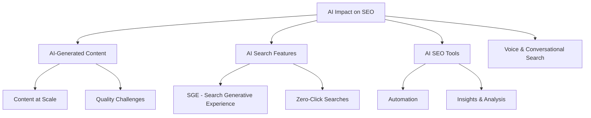

### 1. AI-Generated Content: The 2026 Reality

#### Current State

As of January 2026, AI content is mainstream in SEO:

- 19% of Google search results include AI-generated content
- 13% of top-rated content is AI-generated
- 75% of SEO professionals use AI to reduce time on manual tasks

#### Google's Official Stance (Updated 2026)

**What Google Says:**
> "Content created primarily for search engine rankings, regardless of whether it's generated by AI, violates our spam policies. However, automation—including AI—can be useful for creating helpful content."

**Translation:**

- AI content isn't penalized simply for being AI-created
- What matters is quality, usefulness, and trustworthiness
- Focus on serving users, not gaming algorithms

#### When AI Content Succeeds

**✅ AI Content Works When:**

- Human expertise guides the process (40%+ human input)
- Facts are verified from primary sources
- Content demonstrates genuine experience (E-E-A-T)
- Unique insights and perspectives are added
- Brand voice is authentic and consistent
- Content solves user problems better than competitors

#### When AI Content Fails

**❌ AI Content Fails When:**

- Created solely to manipulate rankings
- Published at massive scale without quality control
- Contains AI "hallucinations" (false information)
- Lacks original insight or value
- Simply rewrites existing content
- Obvious AI patterns remain (repetitive structure, generic phrasing)

### 2. The Optimal AI Content Workflow

Based on content that ranks in 2026:

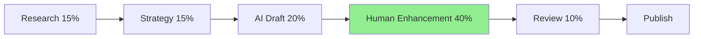

#### Stage 1: AI-Powered Research (15%)

**What AI Excels At:**

- Analyzing competitor content
- Identifying content gaps
- Generating topic clusters
- Extracting keyword opportunities
- Summarizing research

**Tools:**

- ChatGPT / Claude: Topic research and ideation
- Perplexity AI: Research with cited sources
- Semrush AI: Keyword and competitor analysis
- Surfer AI: Content optimization insights

**Example Prompt:**
```
Analyze the top 10 ranking pages for "Thailand travel planning" and:

1. Identify common topics they all cover
2. Find gaps where none provide comprehensive answers
3. Suggest unique angles I could take
4. List related questions people ask
5. Recommend ideal content structure
```

#### Stage 2: Human Strategy (15%)

**What Humans Must Do:**

- Define unique angle based on expertise
- Align with brand voice and values
- Determine target audience specifics
- Set content goals (awareness, conversion, etc.)
- Create detailed outline

**Critical Thinking Questions:**

- What unique experience can I bring?
- What do I know that AI doesn't?
- How can I demonstrate expertise?
- What examples from my business apply?
- What customer pain points am I addressing?

#### Stage 3: AI Draft Generation (20%)

**Using AI Effectively:**

**Detailed Prompt Example:**
```
Write a comprehensive guide section about "Planning Your Thailand Budget" 
for experienced travelers aged 30-50 with moderate budgets.

Context: This is for a travel agency website. Our brand voice is knowledgeable 
but approachable, with a focus on authentic experiences over luxury.

Include:
- Daily budget breakdown (accommodation, food, transport, activities)
- Money-saving tips from local knowledge
- Hidden costs travelers often miss
- Seasonal price variations

Tone: Conversational but authoritative
Length: 800-1000 words
Format: Use H3 subheadings, short paragraphs, bullet points where helpful

Do NOT use these overused AI phrases: "delve into," "navigate the landscape," 
"in today's digital age," "it's worth noting"
```

**Best Practices:**

- Provide extensive context
- Specify exact requirements
- Include brand voice guidelines
- Give examples of desired style
- Explicitly ban AI-isms

#### Stage 4: Human Enhancement (40%) - MOST CRITICAL

**This is where content becomes rankable:**

**What to Add:**

1. **Personal Experience:**
```
❌ AI: "Thailand has beautiful beaches."
✅ Human: "When I first stepped onto Railay Beach in 2019, the limestone 
cliffs rising from turquoise water left me speechless. I've returned four 
times since, and it never gets old."
```

2. **Specific Data:**
```
❌ AI: "Prices vary by season."
✅ Human: "Based on our agency's booking data from 500+ trips, we've found 
hotel prices in Phuket increase 40-60% during December-February compared to 
May-October."
```

3. **Unique Insights:**
```
❌ AI: "Try local street food."
✅ Human: "Skip the touristy Pad Thai stalls on Khao San Road. Instead, 
head to Soi Rambuttri after 6 PM where locals eat—look for the cart with 
the longest line of Thai people. That's where you'll find the best Som Tam."
```

4. **Expert Opinions:**
```
Include quotes from:
- Your team's travel specialists
- Partner tour guides in Thailand
- Industry experts
- Customer testimonials with specific details
```

5. **Original Media:**
```
- Photos from your actual trips
- Screenshots of booking processes
- Custom infographics with your data
- Videos of destinations/experiences
```

6. **Fact-Checking:**
- Verify EVERY statistic
- Check ALL dates and prices
- Confirm business hours and contact info
- Update seasonal information
- Cross-reference with official sources

7. **Voice & Personality:**
```
❌ AI: "Thailand offers diverse experiences."
✅ Human: "Here's the truth: Thailand is so diverse that your trip could range 
from meditating in mountain temples to partying on island beaches—sometimes 
in the same day. And that's exactly why it's perfect."
```

#### Stage 5: Quality Review (10%)

**Final Checklist:**

**E-E-A-T Verification:**

- [ ] Author bio with credentials included
- [ ] Personal experiences woven throughout
- [ ] First-hand photos/videos embedded
- [ ] Expert quotes and citations
- [ ] All claims fact-checked and sourced
- [ ] "Last Updated" date current

**AI Detection Prevention:**

- [ ] No repetitive sentence structures
- [ ] Varied paragraph lengths
- [ ] Natural transitions between topics
- [ ] Zero "AI-isms" remaining
- [ ] Reads like human wrote it

**Technical Check:**

- [ ] Target keywords used naturally
- [ ] Meta title and description optimized
- [ ] Headers properly structured (H2, H3)
- [ ] Internal links to relevant content
- [ ] Images optimized with alt text
- [ ] Schema markup implemented

### 3. AI-Powered SEO Tools (2026)

#### Content Creation & Optimization

**Surfer SEO + AI**

- AI-powered content editor
- Real-time optimization suggestions
- Competitive analysis
- Content score based on top rankers

**Jasper AI (Formerly Jarvis)**

- Long-form content generation
- Brand voice customization
- SEO mode for optimization
- Templates for various content types

**Frase.io**

- Research automation
- Content brief generation
- AI writing assistance
- Answer engine optimization

**MarketMuse**

- Content intelligence platform
- Topic modeling
- Content gap analysis
- Competitive content insights

#### Keyword Research & Analysis

**Semrush AI Tools**

- AI-powered keyword clustering
- Intent analysis
- Content recommendations
- Automated reporting

**ChatGPT/Claude for Keyword Research**

- Generate keyword variations
- Identify search intent
- Create content clusters
- Analyze competitor keywords

**Effective Prompt:**
```
I'm targeting "Thailand travel insurance" for my travel agency website.

Generate:
1. 20 related long-tail keywords with search intent
2. 10 question-based queries people ask
3. 5 content cluster topic suggestions
4. Semantic keywords to include naturally
5. Related topics for internal linking

Format as a table with columns: Keyword | Intent | Est. Difficulty | Content Type
```

#### Technical SEO Automation

**Screaming Frog (AI Features)**

- Automated site audits
- AI-powered recommendations
- Custom extraction with AI

**Alli AI**

- Automated on-page optimization
- Bulk SEO changes
- AI-driven recommendations
- Real-time testing

#### Link Building & Outreach

**Pitchbox AI**

- AI-powered prospect research
- Automated personalization
- Follow-up sequence optimization

**BuzzStream AI**

- Relationship management
- Outreach automation
- AI writing assistance

### 4. Google's AI Search Features

#### Search Generative Experience (SGE)

**What It Is:**

Google's AI-powered search results that generate summaries and answers directly in search results.

**Impact on SEO:**

- Potential for "zero-click" searches (users get answers without clicking)
- Changes in click-through rates
- New optimization strategies needed

**How to Optimize for SGE:**

1. **Structured Data:**
```html
<!-- FAQ Schema helps AI understand your content -->
<script type="application/ld+json">
{
  "@context": "https://schema.org",
  "@type": "FAQPage",
  "mainEntity": [{
    "@type": "Question",
    "name": "What's the best time to visit Thailand?",
    "acceptedAnswer": {
      "@type": "Answer",
      "text": "The ideal time to visit Thailand is November to February, 
      during the cool, dry season. Temperatures average 25-30°C (77-86°F) 
      with minimal rainfall, perfect for beach and cultural activities."
    }
  }]
}
</script>
```

2. **Direct, Concise Answers:**

- Answer questions clearly in first 2-3 sentences
- Use natural language
- Provide context and details after initial answer

3. **Entity Optimization:**

- Use consistent terminology
- Define entities clearly
- Link related entities

4. **E-E-A-T Signals:**

- Author credentials prominently displayed
- Clear sourcing and citations
- Demonstrate expertise

#### Featured Snippets & Position Zero

**Still Valuable in AI Era:**

Even with SGE, featured snippets provide visibility and traffic.

**Optimization Tactics:**

**Question-Answer Format:**

```html
<h2>What is the best time to visit Thailand?</h2>
<p>The best time to visit Thailand is from November to February. During these months, 
you'll experience pleasant weather with temperatures between 25-30°C and minimal rainfall. 
This is Thailand's peak tourist season, ideal for both beach activities and cultural exploration.</p>
```

**List Formats:**

```html
<h3>Top 5 Things to Do in Bangkok</h3>
<ol>
  <li><strong>Visit the Grand Palace:</strong> Thailand's most famous landmark</li>
  <li><strong>Explore Wat Pho:</strong> Home to the massive Reclining Buddha</li>
  ...
</ol>
```

**Table Format:**

```html
<table>
  <tr>
    <th>Season</th>
    <th>Weather</th>
    <th>Best For</th>
  </tr>
  <tr>
    <td>November-February</td>
    <td>Cool & Dry</td>
    <td>All activities</td>
  </tr>
  ...
</table>
```

### 5. Voice Search & Conversational AI

**Growth of Voice Search:**

- 50%+ of searches expected to be voice-based by 2026
- Different optimization requirements
- Natural language focus

**Voice Search Optimization:**

**1. Conversational Keywords:**
```
❌ Traditional: "Thailand beach resorts"
✅ Voice: "What are the best beach resorts in Thailand for families?"
```

**2. Question-Based Content:**

- Who, what, when, where, why, how
- Complete sentences in answers
- Natural conversational tone

**3. Local Optimization:**

- "Near me" searches
- Complete NAP information
- Google Business Profile optimization

**4. Featured Snippet Targeting:**

- Voice assistants often pull from featured snippets
- Provide concise, direct answers
- Use structured data

**Voice Search Content Example:**
```
Q: How much does a trip to Thailand cost?

A: A 10-day trip to Thailand typically costs between $1,500 and $3,000 per person, 
depending on your travel style. This includes flights, accommodation, meals, 
activities, and local transport.

Budget travelers can manage with $50-75 per day, mid-range travelers should budget 
$100-150 per day, while luxury travelers may spend $200-400+ daily.

The biggest expenses are usually international flights ($600-1,200) and accommodation 
($15-150+ per night depending on your choices).
```

### 6. AI SEO Strategy: Putting It All Together

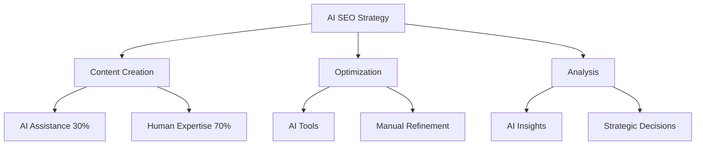

#### The Hybrid Approach (Best Practice for 2026)

**What AI Should Do:**

- Initial research and data gathering
- First drafts and outlines
- Technical optimization suggestions
- Competitor analysis
- Keyword clustering
- Performance reporting

**What Humans Must Do:**

- Strategic direction
- Experience-based insights
- Final content refinement
- Relationship building (outreach)
- Creative ideation
- Quality assurance
- Ethical oversight

### 7. Future-Proofing Your SEO Strategy

**Principles That Won't Change:**

1. **User Intent First:**

- Understand what users really want
- Provide genuine value
- Solve real problems

2. **Quality Over Quantity:**

- Fewer excellent pieces beat many mediocre ones
- Depth matters more than volume
- Expertise demonstrates authority

3. **E-E-A-T Signals:**

- Experience, Expertise, Authoritativeness, Trust
- Will remain Google's quality benchmark
- Human element increasingly important

4. **Technical Excellence:**

- Fast, mobile-friendly, secure sites
- Proper indexation and crawlability
- Structured data implementation

5. **Authentic Relationships:**

- Real backlinks from real websites
- Genuine brand mentions
- Community engagement

**Adapting to AI Search:**

**Short-Term Actions (2026):**

- Optimize for featured snippets
- Implement comprehensive schema markup
- Focus on question-answer content formats
- Enhance E-E-A-T signals
- Monitor SGE performance

**Long-Term Strategy:**

- Build brand recognition (branded searches matter more)
- Create truly unique, experience-based content
- Develop proprietary data and research
- Establish topical authority
- Invest in user experience

### Key Takeaway: AI as Tool, Not Replacement

**The Winning Formula:**
```
AI Efficiency + Human Expertise = Sustainable SEO Success
```

**Remember:**

- AI accelerates research and drafting
- Humans provide experience and expertise
- Combination creates unbeatable content
- Ethics and quality always matter
- User value is the ultimate ranking factor

**Action Steps:**

1. **Audit Your Current AI Usage:**

   - Where are you using AI?
   - Is it helping or hurting quality?
   - Are E-E-A-T signals present?

2. **Implement 40% Rule:**

   - Ensure 40%+ of final content is human-enhanced
   - Add personal experiences
   - Include original data/insights

3. **Establish Quality Standards:**

   - Create content review checklist
   - Verify all facts
   - Remove AI patterns

4. **Monitor AI Search Impact:**

   - Track SGE appearances
   - Measure zero-click rates
   - Adjust strategy accordingly

5. **Stay Informed:**

   - Google algorithm updates
   - AI search developments
   - Industry best practices
   - Tool innovations

---

## Conclusion: Your SEO Success Roadmap

SEO is not a destination—it's an ongoing journey. The strategies in this guide provide a comprehensive foundation, but success requires consistent effort, adaptation, and focus on delivering genuine value.

### The Core Principles

**1. User First, Search Engine Second**

- Create for humans, optimize for bots
- Solve real problems
- Provide exceptional experiences

**2. Quality Always Wins**

- One exceptional page beats ten mediocre ones
- Depth and comprehensiveness matter
- Expertise shines through

**3. Technical Foundation is Essential**

- Fast, secure, mobile-friendly sites are non-negotiable
- Proper indexation enables discovery
- Core Web Vitals impact rankings

**4. Authority is Earned**

- Build relationships, not just links
- Create link-worthy content
- Demonstrate expertise consistently

**5. AI is a Tool, Not a Shortcut**

- Combine AI efficiency with human expertise
- Maintain ethical standards
- Focus on quality over quantity

### Your 90-Day Action Plan

**Month 1: Foundation**

- [ ] Complete technical SEO audit
- [ ] Set up Google Search Console & Bing Webmaster Tools
- [ ] Conduct comprehensive keyword research
- [ ] Create content calendar
- [ ] Establish baseline metrics

**Month 2: Optimization**

- [ ] Optimize existing high-priority pages
- [ ] Implement pillar & cluster content strategy
- [ ] Begin consistent content publishing
- [ ] Start link building outreach
- [ ] Optimize Google Business Profile (if local)

**Month 3: Scale & Refine**

- [ ] Analyze early results
- [ ] Refine strategy based on data
- [ ] Scale content production
- [ ] Expand link building efforts
- [ ] Document processes

### Measuring Success

**Key Performance Indicators:**

**Traffic Metrics:**

- Organic sessions (monthly)
- Organic users (unique visitors)
- Pages per session
- Average session duration

**Ranking Metrics:**

- Target keywords ranking in top 10
- Average keyword position
- Featured snippet acquisitions
- SGE/AI Overview appearances

**Engagement Metrics:**

- Bounce rate
- Time on page
- Pages per session
- Conversion rate

**Authority Metrics:**

- Referring domains (monthly growth)
- Domain Authority/Rating
- Quality of backlinks
- Brand mention frequency

**Business Metrics:**

- Leads generated from organic
- Revenue attributed to organic
- Customer acquisition cost (organic)
- Return on investment

### Resources for Continued Learning

**Official Documentation:**

- [Google Search Central](https://developers.google.com/search)
- [Bing Webmaster Guidelines](https://www.bing.com/webmasters/help/webmaster-guidelines-30fba23a)
- [Schema.org](https://schema.org/)

**SEO News & Updates:**

- Google Search Central Blog
- Search Engine Journal
- Search Engine Land
- Moz Blog

**Communities:**

- Reddit: r/SEO, r/bigseo
- Twitter/X: Follow #SEO hashtag
- LinkedIn: SEO professional groups

**Tools:**

- Free: Google Search Console, Google Analytics, Google Keyword Planner
- Freemium: Ubersuggest, AnswerThePublic
- Paid: Ahrefs, Semrush, Moz Pro

### Final Thoughts

SEO in 2026 is more sophisticated than ever, but the fundamentals remain unchanged: create exceptional content that serves your audience, build a technically sound website, and earn authority through quality and expertise.

The integration of AI has made certain tasks easier but has also raised the bar for quality. Standing out now requires genuine expertise, authentic experiences, and content that truly serves user needs.

**Success in SEO requires:**

- Patience (results take 6-12 months)
- Consistency (regular publishing and optimization)
- Adaptability (algorithms and best practices evolve)
- Ethics (sustainable strategies, not shortcuts)
- Focus (quality over quantity)

Start with the fundamentals, implement systematically, measure rigorously, and refine continuously. SEO is a marathon, not a sprint—but the rewards of sustainable organic traffic make the journey worthwhile.

**Now it's your turn. Pick one chapter, implement one strategy, and take the first step toward SEO success.**

---

## Disclaimer

This guide provides educational information about SEO and is offered free of charge. While every effort has been made to ensure accuracy, search engine algorithms and best practices constantly evolve. The information presented here reflects best practices as of January 2026.

The author is not providing legal, investment, or professional services through this guide. Readers should seek advice from qualified professionals regarding the applicability of this information to their specific situations.

Examples and case studies are fictional and created for illustrative purposes only. Results may vary based on numerous factors including industry, competition, budget, and implementation quality.

By using this guide, you agree to these terms.

---

**License:** This guide is licensed under the [Creative Commons Attribution-ShareAlike 4.0 License](https://creativecommons.org/licenses/by-sa/4.0/). You are free to share and adapt this material with attribution.

**Last Updated:** January 15, 2026